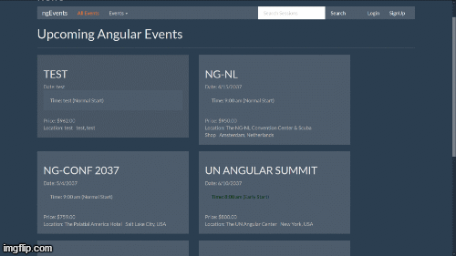

# event-management-springboot-angular
Web application for Event management using springboot and angular

# Springboot
Spriingboot framework is used for development of backend Server.
1. Maven build the project.
1. Integrate with MySql in application.properties file
3. Run as a spring boot application.

# MySql
MySql database is used for the data storage.

# Angular
AngularJs is used for development of frontend application. 
For starters run
1. npm install
2. npm start

# Features
1. User Login/Signup
2. Event Create/Edit
3. Session Create/Edit
4. View Events and sessions
5. Search option for session and events

# Demo

